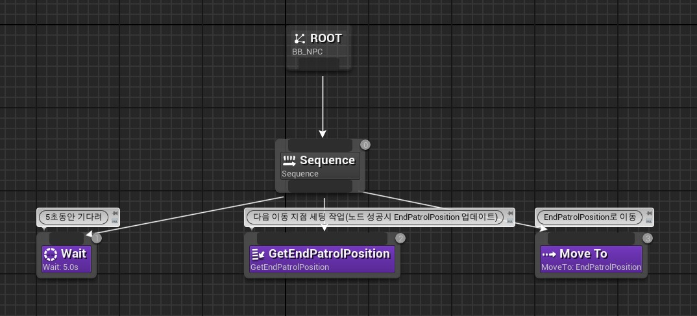
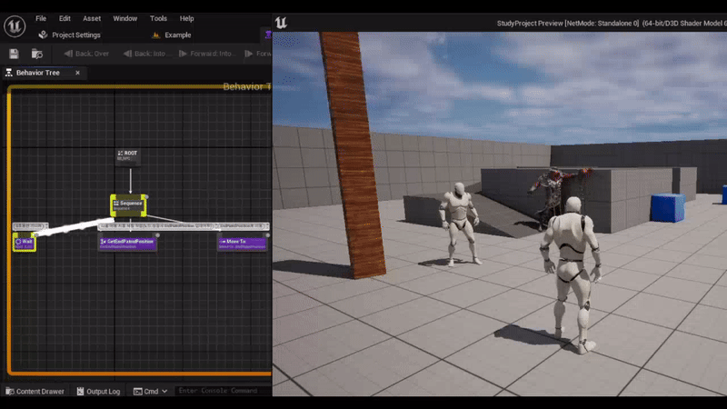
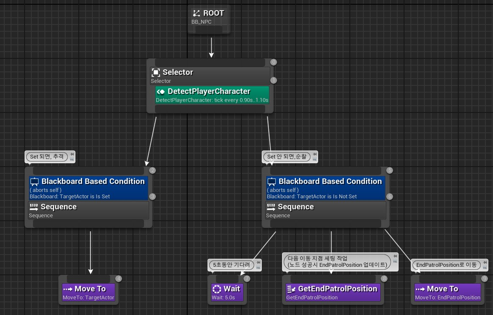
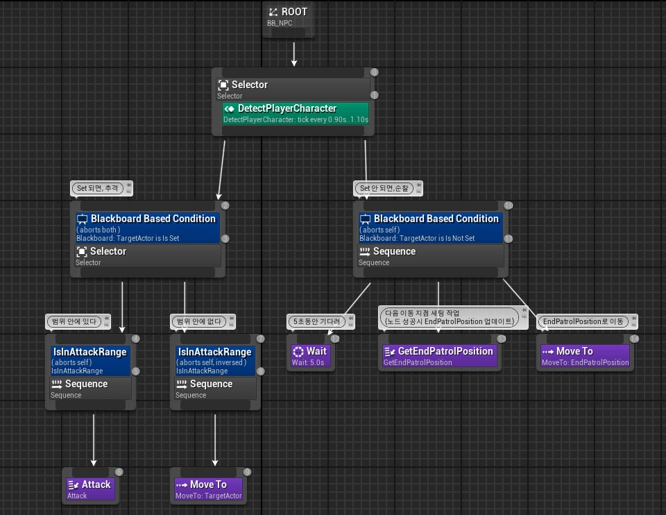
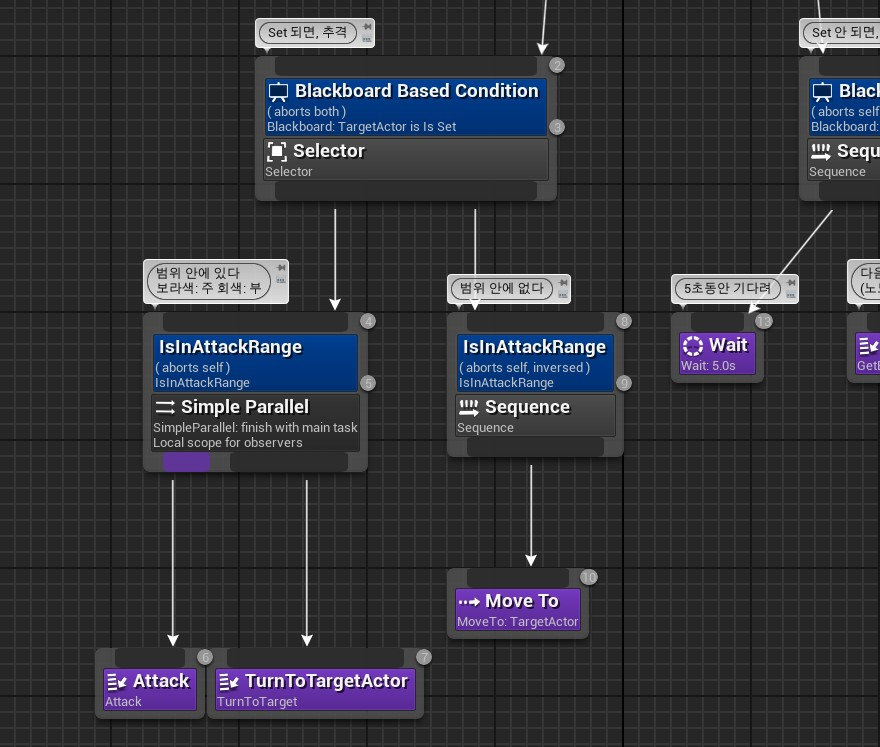
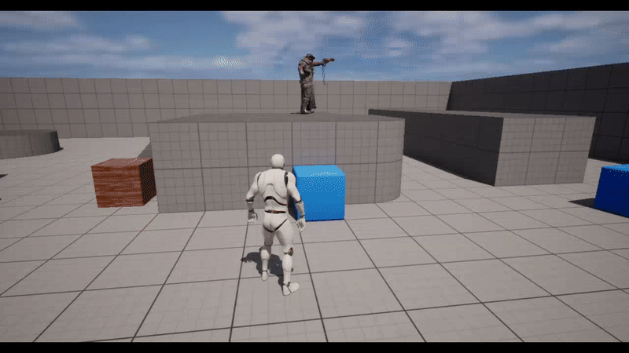
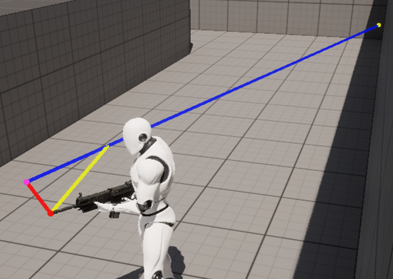
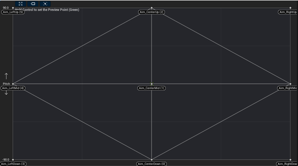

# UE5.1StudyProject(TPS)

### <h3>프로젝트 설명</h3>
- TPS의 간단한 기능 중심으로 개발  
- Unreal Engine을 활용하여 기본적 틀을 갖춘 시스템 위주로 작업  
- Dedicated Server 또한 기본 위주로 작업  

### <h3>작업 과정</h3>
> Melee Attack 및 Combo  
>   

> AI Move0  
>   
>   

> AI Move1  
>   
> 

> AI Attack(Player 사망)  
>   
> 

> AI Attack 방향 수정  
>   
>   
> -수정 전  
>   
> -수정 후

> HPBar 및 KillCount UI  
>   
> HUD에서 Stat 정보를 관리하여 변동이 있을 떄마다 Delegate 호출하여 UI 변경

> 무기 유무에 따른 Animation  
>   
> 무기 장착 여부에 따라 Animation Blueprint 적용하여 상태에 맞는 애니메이션 재생

> Crosshair LineTrace  
>   
>   
> 시야 위치를 구하여 Muzzle과 내적을 통해 Fire 지점을 계산하여 Crosshair에 맞춰 발사되게 연산

> Aim Offset  
>   
>   
> Controller 회전 정보를 통해 AImOffset 적용

> Server Test  
>   
> 무기 및 애니메이션(몽타주 노티파이 등) Replicated 적용  
> Damage Stat 적용 또한 NetMulticast 통해 연산 적용